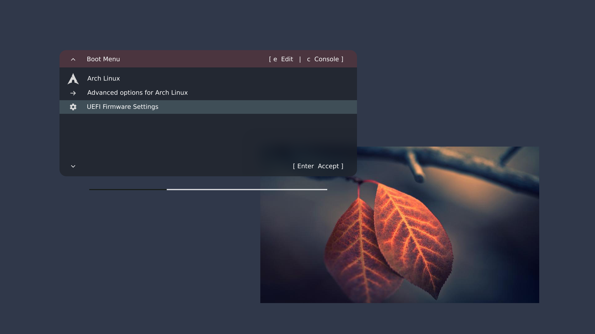
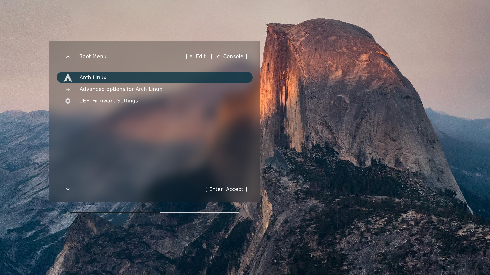
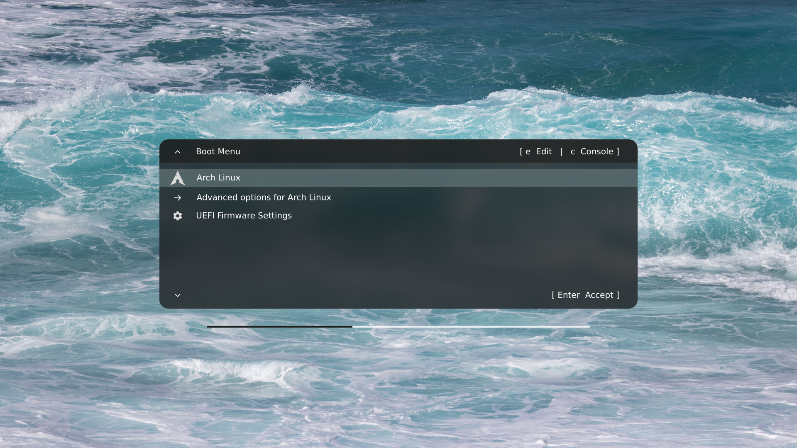

# Evolution

Evolution is a configurable GRUB theme with scalable graphics, background blurring,
and antialiased true-type fonts. Any wallpaper (e.g., your desktop wallpaper) can be
used as theme background.

The style of the Evolution menu can be narrow or wide. A narrow-style menu has
rounded corners, a header that can be colored independently, and rectangular
entries without margins. A wide-style menu has square corners, no separate
header, and rounded entries with left and right margins.

Evolution is configured by changing the value of variables in the installation
script. The most important variables are screen width, screen height, and font
size. All graphics are scaled as a function of font size, so the theme can be
made to look good at any screen resolution. Menu colors, amount of blurring,
dimensions, position, font family, and menu messages can also be configured.

These two screenshots show examples of narrow-style and wide-style menus.





The last screenshot shows what Evolution looks like with the provided default
wallpaper and without any custom configuration except for screen width, screen
height, and font size.



In all cases, the install script detects your GRUB menu entries and assigns
emblems/icons to them automatically. If an entry distro is not recognized,
it is assigned a hashbang (#) as emblem.


# How it works

GRUB does not do font antialiasing natively, so Evolution uses a workaround to
achieve non-pixelated menu entries. Everything in the Evolution menu is built
from antialiased PNG files.

For each entry in your `grub.cfg` file, the install script builds a corresponding
SVG document with an entry emblem and the entry string. This SVG document is then
converted to a **fake entry**--a PNG picture that GRUB will display as if it were
an icon on the left side of each entry.

GRUB still displays the text of actual entries alongside the fake ones, however,
so we mask the right side of the menu with a PNG image split from the background
wallpaper. Also, we cover the borders around each fake entry by sandwiching the
entries between two additional PNG layers. The bottom layer is just the menu
background. The top layer is a duplicate of the bottom layer, except for a
series of hollow contours that let the fake entries show through.


# Limited distribution support

Evolution assumes that the GRUB updating command on your system is `grub-mkconfig`
(as on Arch and Debian, for example) and that your GRUB configuration file, `grub.cfg`,
is located at `/boot/grub/`.

Thus, **Fedora**, or more generally, any distribution that relies on `grub2-mkconfig`
instead of `grub-mkconfig`, **is not supported.**

Evolution has been tested successfully on Arch, elementary OS, and Kubuntu.


# Dependencies

Aside from a functional POSIX system, Evolution requires:

- **ImageMagick** or **GraphicsMagick** to resize, crop, and blur your chosen
wallpaper.

- **rsvg-convert** or **Inkscape** to convert SVG documents to PNG files. Of
these two programs, `rsvg-convert` is the most lightweight, and it may well
be installed on your system without you knowing it. If you choose or need
to install `rsvg-convert`, look for a package named along the lines of
`librsvg` or `librsvg2`.


# Before starting

To configure the install script, you will need to know the width and height
of your screen in pixels **at boot time**. These values must be those used by
GRUB before your graphic driver is loaded, so **do not try to read them from
your desktop environment**.

Instead, **reboot your computer**, and type `c` when the GRUB menu shows up. This
will open a command line with a prompt (`>`). Type `videoinfo` [Enter], and GRUB
will print a list of screen resolutions. The one used at boot time **is prefixed
by an asterisk** (*). For example, with this list:

```
  0x000  320 x  200 x 32 (1280)  Direct color, mask: 8/8/8/8  pos: 16/8/0/24
  0x006  320 x  240 x 32 (1280)  Direct color, mask: 8/8/8/8  pos: 16/8/0/24
  0x007  320 x  200 x 32 (2560)  Direct color, mask: 8/8/8/8  pos: 16/8/0/24
* 0x008 1600 x 1200 x 32 (6400)  Direct color, mask: 8/8/8/8  pos: 16/8/0/24
  0x009 1280 x  800 x 32 (5120)  Direct color, mask: 8/8/8/8  pos: 16/8/0/24
```

boot-time resolution is 1600 x 1200 pixels.


# Installation

First, create a directory somewhere on your computer.

Second, scroll back to the top of this page and have a look at the file tree.
One of the files is called, **evolution.zip**. This zip archive contains all
that you need to install Evolution. Right-click on **evolution.zip** to open
a file menu, and choose the "**Save Link As...**" option.

Once **evolution.zip** saved on your computer, put it in the directory you
just created, and unpack the archive:

```
unzip evolution.zip
```

This will provide you with two shell scripts, `install.sh` and `uninstall.sh`,
and two subdirectories, `data/` and `wallpapers/`. The `data/` subdirectory
contains a list of SVG data needed to create entry emblems. The `wallpapers/`
subdirectory contains the default wallpaper.

Finally, make sure that the install and uninstall scripts are **executable**:

```
chmod u+x install.sh uninstall.sh
```


# Wallpaper setting

If you want to use your own wallpaper, add it to the `wallpapers/` subdirectory.
Your wallpaper must be a valid JPG or PNG file. Its width and height should not
necessarily equal those of the screen at boot time, as the install script will
automatically resize your picture to the correct dimensions.

However, to avoid shape distortion, your wallpaper aspect ratio should preferably
match that of the boot-time screen.

**Important**: if you have some JPG or PNG wallpaper file present in `/boot/grub/`,
move this file out of the way, or it may interfere with theme installation.


# Configuration

Before installing the theme as root, open `install.sh` in your favorite text
editor. The `VARIABLE=VALUE` assignments that need to be configured appear at
the start of the script, in the section titled:

```
# ------------------------------------------------------------
# CONFIGURATION
# ------------------------------------------------------------
```

Each assignment has a default value and is followed by comments (`# ...`)
designed to help you in configuring the theme. The most important assignments
are the first three ones (about `ScreenWidth`, `ScreenHeight`, and `FontSize`),
followed by the name of your wallpaper file (`Wallpaper=...`).

As a first pass, all of the other assignments could be left as is. Change their
values only if you feel the need for it, previewing the changes at each step
(as explained below).

Once done, run the install script it as root:

```
sudo ./install.sh
```

If everything goes well, the script will conclude with the following
message:

```
-----------------------------
Theme installed successfully!
-----------------------------
You can now reboot your computer to see what the theme looks like.
Alternatively, if instead of rebooting you just want to preview
the results, you can use any image viewer to open:

/usr/share/grub/themes/evolution/panel-back.png
/usr/share/grub/themes/evolution/panel-front.png

and

/usr/share/grub/themes/evolution/icons/*png
```

If you do **not** see this message, then something went wrong (and the script will
probably tell you what). A dependency may be missing, for example. The worst kind
of error would be to forget to quote a `VALUE WITH BLANKS IN IT` or to forget a
closing quote (as this would wreak havoc on the whole shell script).

Once you are satisfied with your configuration, reboot your computer to have
the Evolution GRUB theme show up.


## Warnings

Depending on your distribution, using ImageMagick as PNG processor may
lead to warning messages about a "deprecated convert command". These
warning messages, however, do not impede theme installation.

In some rare cases, GRUB may not decode a wallpaper picture correctly. GRUB will
then refuse to load the theme, falling back instead on the default text-based menu.
It may be worth opening your wallpaper file in Gimp and check for bit depth and/or
for the presence of interlacing on export. If everything fails, you may have no
other choice than trying another wallpaper.


# Maintenance

Whenever your distribution updates GRUB, you will need to re-run `sudo ./install.sh`
to restore your theme. Do check carefully, however, for the possibility of breaking
changes in GRUB (your distribution should keep you informed about these).

The theme can be uninstalled at any time by running `sudo ./uninstall.sh`.


# Credits

The default wallpaper is a picture by Magda Ehlers, downloaded from
[pexels](https://www.pexels.com/) on July 12, 2026.

The emblems for Bodhi Linux, OpenSUSE, Parrot OS, and Vanilla OS were
downloaded from the corresponding distribution/OS web sites.

The emblems for Apple, Arch, Debian, Fedora, Gentoo, Mint, Ubuntu, Windows,
as well as the camera, cog, memory, and power emblems, were downloaded from
[pictogrammers](https://pictogrammers.com/library/mdi/).

All of the other emblems were downloaded from Wikimedia Commons or custom made.

Emblems were simplified whenever needed to accomodate a reduced display size.

# Thanks

Thanks to Loric Brevet, Erik Koennecke, and David Niklas for their advice or
help in testing the theme.


# License

MIT

